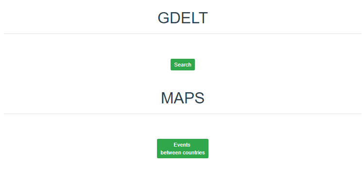
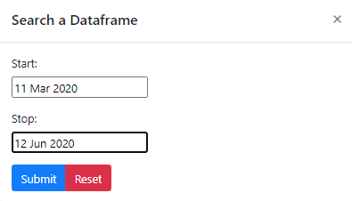
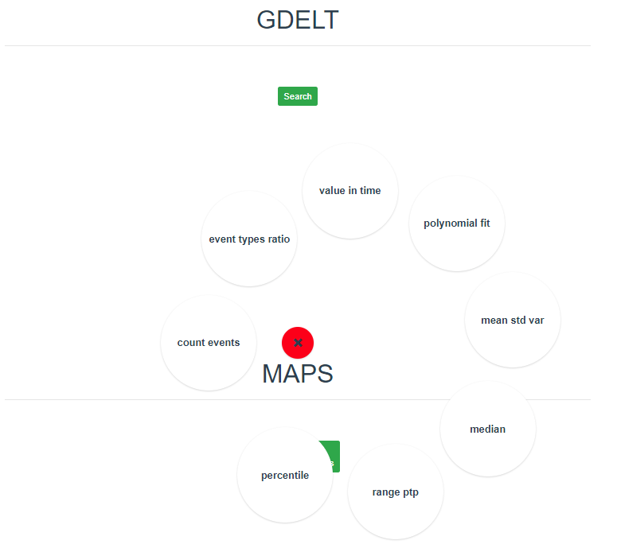
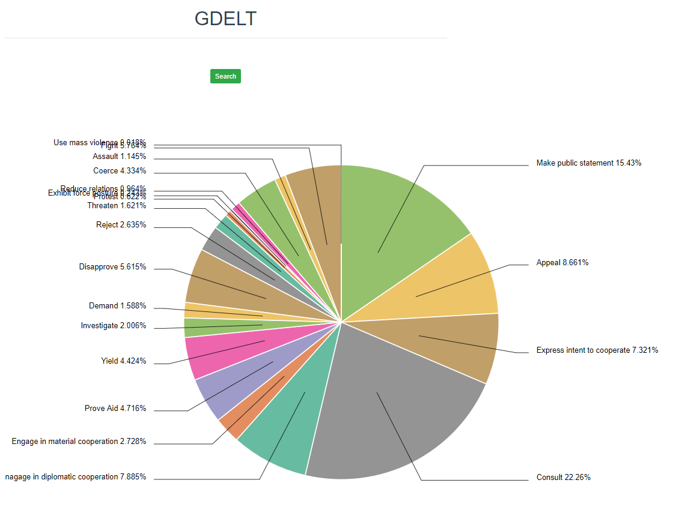

# Gdelt Analysis 
Jest to program zrealizowany w ramach przedmiotu Inżynieria Oprogramowania kierunku Informatyka na Akademii Górniczo-Hutniczej.
Został on zrealizowany w składzie 4-osobowym: Jan Ilczuk, Piotr Dulęba, Ignacy Grudziński, Sebastian Wilk.
## Opis
Program korzysta z systemu GDELT 1.0 z którego za pomoca dostępnego API pobiera dane na temat wydarzeń na świecie w formacie diady, które są uporządkowane w formie tabeli. Część backedowa odpowiada na pobieranie danych, dokonywanie obliczeń i analiz, zapisywanie danych lokalnie i wysyłanie wyników analiz na część frontendową za pomoca REST API.
Część frontendowa odpowiada za interakcję z użytkownikiem, komunikację z częścią backendową w celu pobrania wyników analiz i graficznego reprezentowania wyników w formia map, wykresów itp.

## Uruchomienie
Pobranie repozytorium:
```console
$ git clone https://github.com/dulebapiotr/gdelt-analysis
```
Zainstalowanie wymaganych paczek dla części backendowej:
```console
$ pip install nie pamiętam co xD
```
Zainstalowanie wymaganych paczek dla części frontendowej:
```console
$ npm install nie pamiętam co xD
```
Uruchomienie części backendowej:
```console
$ cd gdelt-analysis
$ python app.py
```

Uruchomienie części frontendowej:
```console
$ cd gdelt-analysis
$ npm run serve
```
## Uruchomienie przykładowej analizy.
Wejdź na stronę:
<http://localhost:8080><br />

<br />
Wybierz zakres czasu:
<br />

<br />
Po załadowaniu danych dostępne są następujące analizy:
<br />

<br />
Wynik przykładowej anlizy - Events type ratio (proporcje poszczegółnych typów zdarzeń):
<br />

<br />
